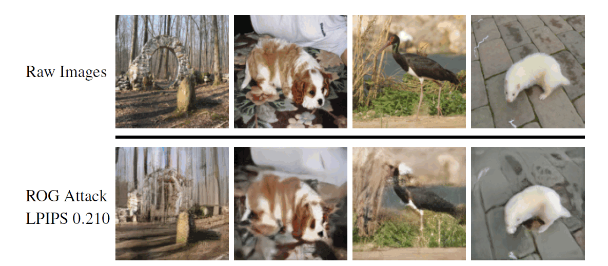

### Gradient Obfuscation Gives a False Sense of Security in Federated Learning
 

Federated learning has been proposed as a privacy-preserving machine learning framework that enables multiple clients to collaborate without sharing raw data. However, client privacy protection is not guaranteed by design in this framework.  Prior work has shown that the gradient sharing strategies in federated learning can be vulnerable to server data reconstruction attacks. In practice, though, clients may not transmit raw gradients considering the high communication cost or due to privacy enhancement requirements. Empirical studies have demonstrated that gradient obfuscation, including the intentional gradient noise injection and the unintentional gradient compression, can provide more privacy protection against reconstruction attacks. In this work, we present a new data reconstruction attack framework targeting the image classification task in federated learning.

<br />



#### Prerequisites

- install Python packages
    ```bash
    pip3 install -r requirements.txt
    ```

- Download the pretrained models and put them under `model_zoos` ([link](https://drive.google.com/drive/folders/1TdHpHQnO7uyTBcHl8GBoxswh8DaKFiTG?usp=sharing))

- The images for a minimal runnable example has been included under `data` folder. The ImageNet validation dataset can be used for a full test. 

<br />

#### Example


- Run the example with QSGD: 
    ```bash
    python3 main.py
    ```
    The script will load the configuration file `config.yaml`. The results will be stored under `experiments`.

- Run the example with FedAvg:
    ```bash
    python3 main_fedavg.py
    ```
    The script will load the configuration file `config_fedavg.yaml`. 


    You can change the settings in the configuration file. For example, use a different compression scheme with 
    ```
    compress: topk
    ```

<br />

